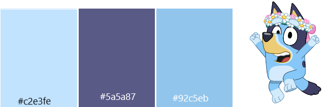
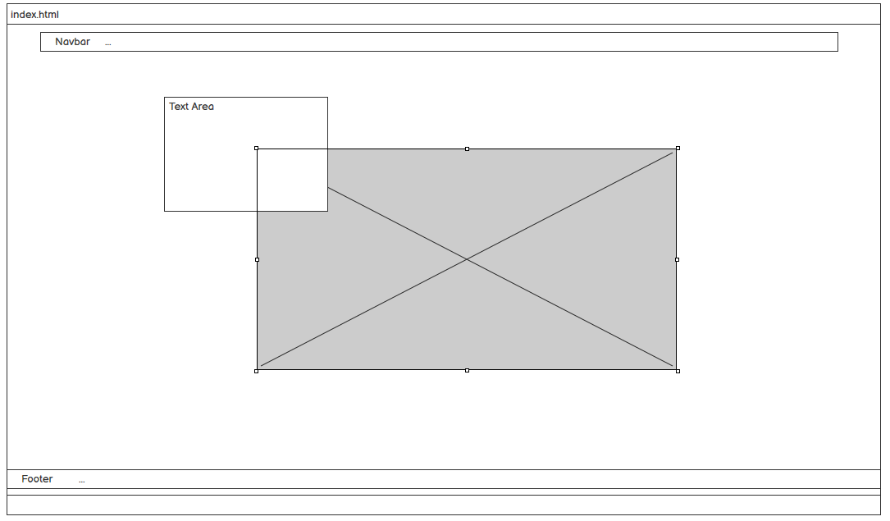
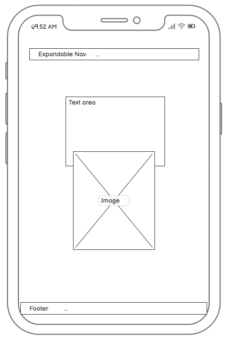
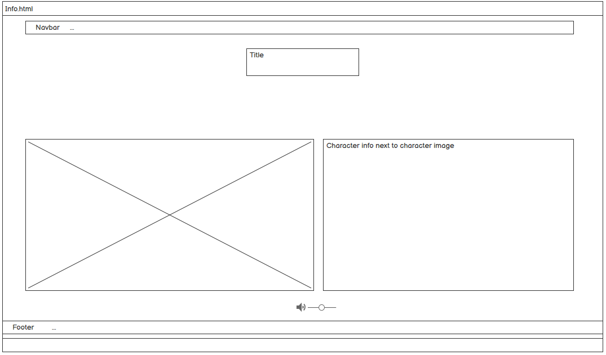
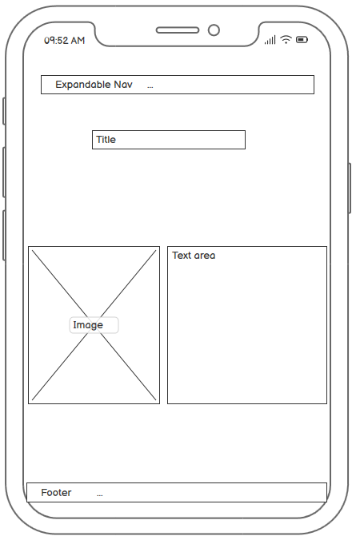
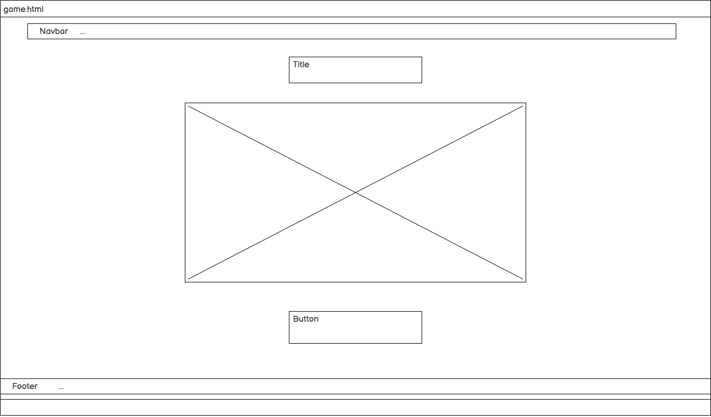
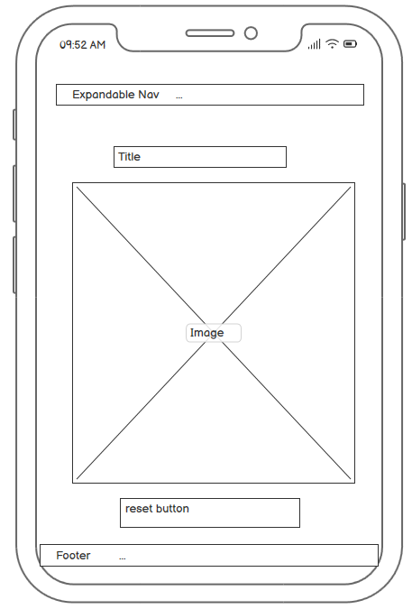
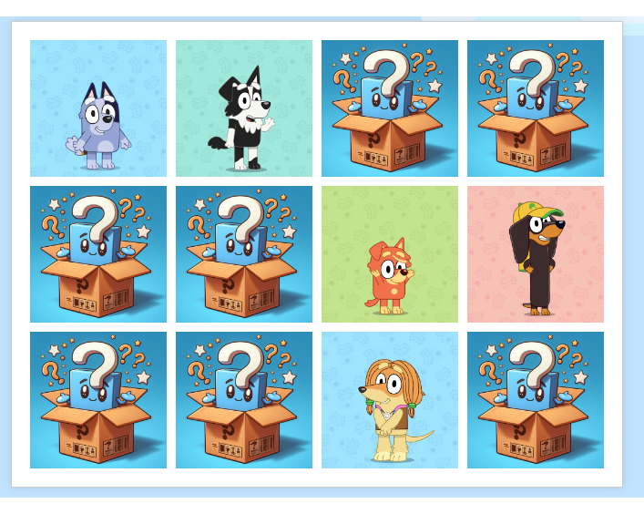

# Bluey! Interactive Front End Design/Development - Milestone Project 2.

Visit the deployed site: [Bluey!](https://mnevison.github.io/MPDeuce/index.html)

I have young children.. So when I mentioned the possibility of making a memory game, the first thing they suggested was doing one based on Bluey. I went for a very friendly vibe with this site, and tried to contain some useful information about the show and main characters along with a game that can be played for hours (my kids were my primary game testers..).

## Contents

- [User Experience](#user-experience-ux)

  - [User Stories](#user-stories)

- [Design](#design)

  - [Colour Scheme](#colour-scheme)
  - [Typography](#typography)
  - [Imagery](#imagery)
  - [Wireframes](#wireframes)
  - [Features](#features)

    - [Future Updates/Changes](#future-improvementschanges)

  - [Accessability](#accessibility)

- [How It Was Built](#how-it-was-built)

  - [Languages Used](#languages-used)
  - [Libraries, Websites & Programs Used](#libraries-websites--programs-used)

- [Deployment & Local Development](#deployment--local-development)

  - [Deployment](#deployment)
  - [Local Development](#local-development)

- [Testing](#testing)

  - [Solved Bugs](#solved-bugs)
  - [Known Bugs](#known-bugs)

- [Credits](#credits)

  - [Code Used](#code-used)
  - [Page Content](#page-content)
  - [Media](#media)
  - [Acknowledgements](#acknowledgements)

***

## User Experience (UX)

  ### User Stories

  #### First Time Visitor Goals

  - I LOVE Bluey and I can't get enough!
  - I want something to entertain my kids!
  - I want to find my way around the site easily.

  #### Returning Visitor Goals

  - I LOVE Bluey and I can't get enough!
  - Explore the site, look at the useful link's that show you everything Bluey!

  #### Frequent Visitor Goals

  - I LOVE Bluey and I can't get enough!
  - Playing the memory game - Simple design with a nice pop-up that gives that gratification upon completion.

  ***

  ## Design

  ### Colour Scheme

  The colours used across the site are all represented in the main character of the show.. Bluey!. When doing research into the character (that wasn't just my kids telling me about how good the show was..) I came across the official Bluey website [Bluey.tv](https://www.bluey.tv/) where I was able to get a bit of inspiration on the project. This website ended up being VERY useful throughout the project from a design perspective.

  Here are the hex values I used:

  

  These were added across the site as custom CSS variables, so if I ever wanted to change the colours it would be a case of changing 3 things rather than going through the whole site where colour is applied.

  ### Typography

  I was able to find my found of choice on Google Fonts.

  I would have loved to use the "Bluey" font (Hello Headline) however I was unable to find a free version of it! Failing that, I wanted something with a "cartoony" vibe, but something that was also very readable. I settled on "Margarine" as the final font for the site.

   - **Script Typeface**: Margarine is classified as a script typeface, meaning it mimics cursive handwriting or calligraphy.
   - **Retro Feel**: It has a vintage, mid-20th-century aesthetic with a friendly, casual vibe.
   - **Thick Strokes**: The letters are bold with thick strokes, making it highly legible and impactful.
   - **Rounded Edges**: The edges of the characters are rounded, adding to its approachable and warm appearance.

  

  ### Imagery 

  All the images I used on the website I was able to get from [Bluey.tv](https://www.bluey.tv/). Being the "official" Bluey website, they had a wealth of resources on the show and character. 

 - I wanted a nice hero Image for the site and was able to get a nice one of the Heeler family going on a trip!

 - For the game I wanted to use something other than the main cast - So I decided to go with Bluey's friends. 

 - I generated the image to hide the friend cards using AI ([Bing](https://www.bing.com/images/create)).
 
 - Fontawesome was used in the footer for brand logos.

  ### Wireframes
  
  Wireframes were created for various devices using Balsamiq

   
   
   

  ### Features 

  The website is set across 3 pages, made up of the home page, an information page and the game page. 

  Each page is responsive across a range of popular devices.

  - Each page has an "on theme" Favicon.
  - Navigation is present across the site.
  - The footer is present on each page which contains a nav link back to the home page, and also access to popular social media links related to Bluey.
  - I've added an audio element to the information page, where you can listen to the Bluey theme until your hearts content!
  - And it wouldn't be a good game website without.. a game! Again, you can play this until your hearts content.
  - Custom 404 page to handle any navigation issues. 

  ### Future Updates/Changes

  I am overall pretty happy with the site in its current form. 

  - I would have liked to add character sounds for the game. When you pair a character and get a match, it would have been nice to get a voice snippet. I would have also liked to add a game completion audio que.

  ### Accessibility 

  While building the website I have been mindful of accessability and have tried to make as much of the site as accessible as possible. I've done this by:

- Using semantic HTML elements.
- Adding hover effects to all interactive links and also making them keyboard-focusable.
- Using a primary font that was designed with accessability in mind, and also having a sans-serif font as a back-up.
- Choosing colours that have a good contrast across the site.
- All links are keyboard focusable.
- Alt tags added to all images, even the ones used within the game. 

---

## How It was Built

### Languages Used

As per the requirements of the project, the languages used across the site are HTML, CSS & JavaScript. 

### Libraries, Websites & Programs Used

- [VSCode](https://code.visualstudio.com/) - IDE of choice for the site.
- [Git](https://git-scm.com/) - For version control.
- [GitHub](https://github.com/) - To store all files relating to the project.
- [Balsamiq](https://balsamiq.com/) - For the wireframes used to mock-up the site.
- [Favicon.io](https://favicon.io/) - Used for the sites favicon.
- [Bing Designer](https://www.bing.com/search?q=Bing+AI&showconv=1&sendquery=1&FORM=HDRSC2) - Used to create my AI profile picture.
- [Google Fonts](https://fonts.google.com/) - For the font used across the site.
- [Font Awesome](https://fontawesome.com/) - For the brand icons.
- [Google Dev Tools](https://developer.chrome.com/docs/) - Dev tools used throughout the build process.
- [Am I Responsive](https://ui.dev/amiresponsive) - Used for the Multi Screen display images in the documentation.
- [Sweetalert2](https://sweetalert2.github.io/#download) - JS Library used for custom pop-ups (Used on game completion).
- [Bluey! Official](https://bluey.tv) - Wealth of information on the subject of the website. Used for inspiration, imagery, audio etc. 
- [Boostrap 5.3](https://getbootstrap.com/) - Used various assets/custom classes across the site to aid with development speed and responsiveness.

---

## Deployment & Local Development

### Deployment

This site is deployed via GitHub Pages: [Bluey!](https://mnevison.github.io/MPDeuce/index.html)

1. Login to Github (Or sign up).
2. Go to the repository for this project, <https://github.com/mnevison/milestone-p1>
3. Click on the settings button.
4. Select "pages" in the navigation on the left side.
5. From the source drop down, select the "main" branch and save.
6. The site is now deployed! This process may take a few minutes, but you will see a "deployments" section on the lower right with your live link.

### Local Development

#### How to Fork

To fork the repository:

1. Log in (or sign up) to Github.
2. Go to the repository for this project, <https://github.com/mnevison/MPDeuce>
3. Click the Fork button in the top right corner.

#### How to Clone

To clone the repository:

1. Log in (or sign up) to GitHub.
2. Go to the repository for this project, <https://github.com/mnevison/MPDeuce>
3. Click on the code button, select whether you would like to clone with HTTPS, SSH or GitHub CLI and copy the link shown.
4. Open the terminal in your code editor and change the current working directory to the location you want to use for the cloned directory.
5. Type 'git clone' into the terminal and then paste the link you copied in step 3. Press enter.

---

## Testing

Please see [TESTING.md](TESTING.md) for all testing that has been carried out.

### Solved Bugs

- The main "bug" I experienced was with my game allowing a user to brute force cards and flip over more than intended. This was solved by adding additional functionality to the click events handling and timeouts.

 - I was getting an error in the console when running the game - 
  "TypeError: Cannot read properties of undefined (reading 'getAttribute')
    at processFlippedCards (game.js:107:19)
    at game.js:77:9"
    - This was resolved by adding some defensive checks, making sure there were exactly 2 cards stored and that they were both defined correctly. 

## Credits

### Code Used

- Found a Youtube Tutorial on memory games that I used as a guide for the structure of the game. [https://www.youtube.com/watch?v=t3cydTwfEnM]

- The audio.js was re-used from a project I did for my daughter. [https://github.com/mnevison/arya-cats-project]

### Page Content

- As mentioned at various parts throughout the documentation, the Official Bluey website was used throughout the build process for various resources and inspirations. 

### Acknowledgements 

I would like to give special acknowledgements to:

- UCP-15 Discord - For always providing feedback on my project.
- Jubril Akolade - My Code Institute mentor.
- Cameron Rafferty - For being a great sounding board and just generally a top bro. 

