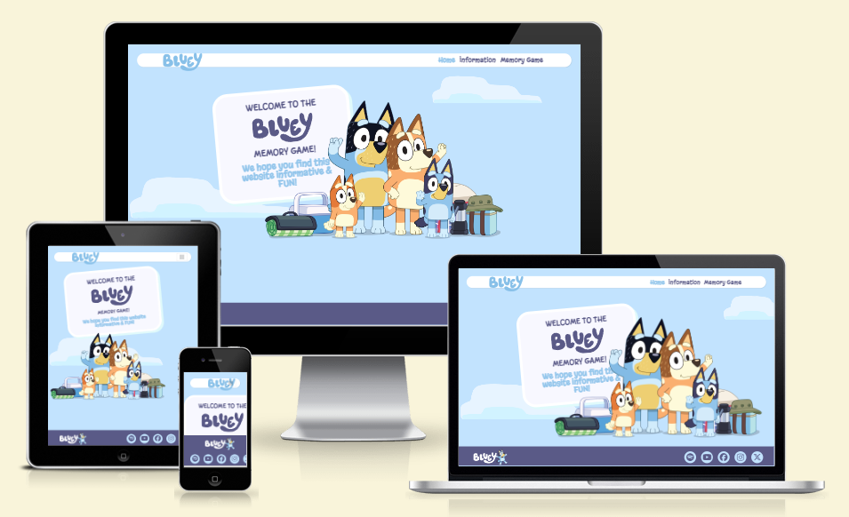
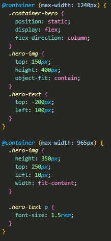
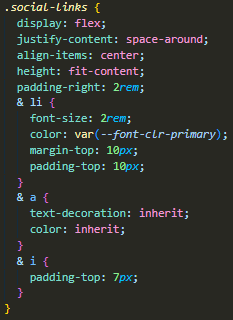
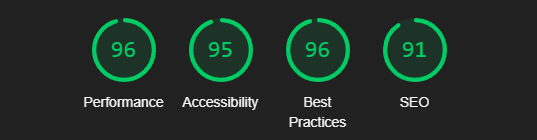
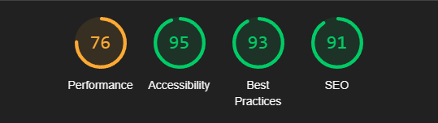
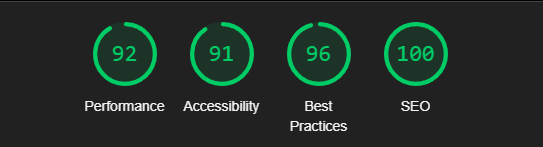
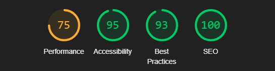
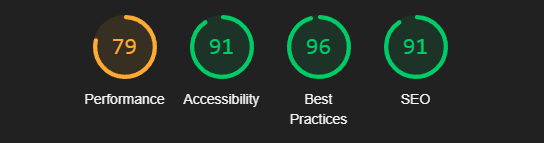
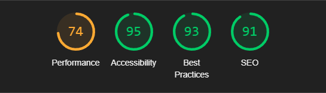
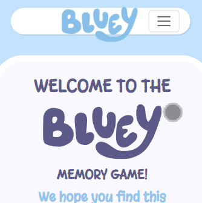

# Bluey! Interactive Front End Design/Development - Milestone Project 2.

Visit the deployed site: [Bluey!](https://mnevison.github.io/MPDeuce/index.html)

---

## Contents

- [Automated Testing](#automated-testing)

  - [W3 Validator - HTML](#w3-validator---html)
  - [W3 Jigsaw - CSS](#w3-jigsaw---css)
  - [JSHint - Javascript](#jshint---javascript)
  - [Lighthouse](#lighthouse)

- [Manual Testing](#manual-testing)

  - [User Stories](#testing-user-stories)
  - [Full Site & Feature Testing](#full-site--feature-testing)
    - [Devices](#devices)
    - [Features](#features)

    ---

## Automated Testing

### W3 Validator - HTML

[W3C Validator](https://validator.w3.org/) has been used to ensure the validity of the HTML markup across the project.

- [Index/Home](docs/testing/w3c-home.png) - Fixed 1 issue with an aria-current label being incorrect - No errors.
- [Information](docs/testing/w3c-info.png) - Fixed 1 issue with an aria-current label being incorrect - No errors.
- [Game](docs/testing/w3c-game.png) - Fixed 1 issue with an aria-current label being incorrect - No errors.

### W3 Jigsaw - CSS

- [CSS](docs/testing/w3jigsaw-css.png) - This image will show 9 "errors" - I have chosen to leave these errors for the following reason:

    - When going through the project I wanted to try some different things vs my first one. One of those things was using "modern" CSS - The methods I used have good browser support (Tested on Chrome, Safari, Edge and Firefox) and the CSS works across the site. 

    - The first "error" is related to "Container Queries" - An alternative to "Media Queries". You need to define the container by defining the "container-type".
        - 
        - This is what a "Container Query" looks like - Very much like a media one, but your targeting one specific container rather than the whole site. As I used Bootstrap assets, not everything needed to be included, hence why I wanted to try "Container Queries".

    - The rest of the errors are related to "Nesting" - I find this method to be a cleaner way to do CSS for the most part, where applicable. You target the parent, and then within the parent you can target the children and style them in a block which is easier to read and follow along with. 
        - 

### JShint - Javascript 

[JSHint](https://jshint.com/) has been used to validate my JavaScript. 

[JSHint - Audio](docs/testing/jshint%20-%20audio.png) - Passed with No errors

[JSHint - Game](docs/testing/jshint%20-%20game.png) - The error shown is related to scoping has been left as is. I feel that trying to correct this error would over-all lead the code actually being more semantically confusing. 

- Unused variable is related to "Sweetalerts2" - The pop-up works as intended. 

### Lighthouse 

I ran each page of my site through Lighthouse on Google Dev Tools to test the various performance metrics it measures. Overall I'm happy with the majority of the scores - Performance seems to take a hit on mobile, and specifically desktop & mobile on the game page. I believe changing my images to a webp format might increase these performance metrics, however - Based on the below information I am still happy with where it's landed in its current form. 

_Lighthouse results range from 0-100. Ranges 0-49 are seen as "poor" 50-89 are considered good, and anything over 90 would be excellent. The changes I made to increase my scores regarding accessibility were done within my "footer" - my links were aria-hidden: true which causes issues for screen readers. I improved my SEO score by added more descriptive meta data within the head section of each page - basic description of the site and details of the author._

#### Home Results

#### Information Results

#### Game Results

---

## Manual Testing

### Testing User Stories

**First Time Visitor Goals**

| Goals                                              | How are requirements met?                                                                                                                                                      |
| -------------------------------------------------- | ------------------------------------------------------------------------------------------------------------------------------------------------------------------------------ |
| I LOVE Bluey and I can't get enough! | This website has LOTS of Bluey related content |
| I want something to entertain my kids!| The site is easy to use and accessible. It contains information on the characters kids love, as well as a game that can provide lots of fun. |
| I want to find my way around the site easily       | Each page of the website, regardless of device has a dedicated navbar at the top of the page. The page title can also be interacted with to bring users back to the home page. |

**Returning Visitor Goals**

| Goals                                                              | How are requirements met?                                                                                                  |
| ------------------------------------------------------------------ | -------------------------------------------------------------------------------------------------------------------------- |
| I LOVE Bluey and I can't get enough! | Who doesn't, right? Again, Lots of Bluey here!. |
| I want more information on Bluey. | The site footer contains links to a wealth of Bluey related content. |

**Frequent Visitor Goals**

| Goals                                                                   | How are requirements met?                                                                                                                                                                                                                                                                                                      |
| ----------------------------------------------------------------------- | ------------------------------------------------------------------------------------------------------------------------------------------------------------------------------------------------------------------------------------------------------------------------------------------------------------------------------ |
| I LOVE Bluey and I can't get enough!  | .. We get it. You love Bluey! |
| I want to play the GAME! | The game can be accessed via the navigation on any device, has a reset button for when you get that initial dopamine hit, you can just keep going! |

--- 

## Full Site & Feature Testing

### Devices

The site was built using VSCode on a desktop Windows based PC. When testing the site features and responsiveness I tried to use a range of devices I had at my disposal, as well as asking friends and peers to check the site.

Devices I used to check personally are:

- Primary Display

  - AOC 24" 1080p Monitor

- Laptop

  - Lenovo Thinkpad 14inch

- Mobile
  - Google Pixel 7
  - Google Pixel 7a
  - Google Pixel 6
  - Samsung s20

I tested the site using Google Chrome, Microsoft Edge and Firefox on the Desktop & Laptop. Mobile devices are running Chrome, and I was able to use the Samsung Browser on the s20.

_Unfortunately I don't have access to any Apple products, so I was unable to test the site on these devices myself - However, a class mate was able to test Safari for me and reported no issues._

---

## Features

### Header & Footer

The Header & Footer of the site are present on each page. The header will typically always be in view, as it is the users primary way to navigate around the site. When the site is viewed on a mobile device the navigation will reduce in size and have a drop-down menu. The footer will also re-size and re-shape accordingly. 

**Testing**

| Feature                                | Expectation                                                                                         | Test Performed                      | Outcome                                                                     |
| -------------------------------------- | --------------------------------------------------------------------------------------------------- | ----------------------------------- | --------------------------------------------------------------------------- |
| Click the Bluey Logo                         | Navigate back to home                                                                               | Clicked link                        | Refreshed/Changed page                                                      |
| Nav Links                              | Take user to required page                                                                          | Clicked link                        | Went to intended page                                                       |
| Hover effect                           | Alter colour/Apply "Bounce" effect                                                 | Hovered over                        | Colour changed/Bounced                                                              |
| Header always on top on mobile devices | Header element and contents (title and navigation) remain on top of content                         | Screen resized & scrolled down page | Header was on top of contact and all interactions still present and working |
| Active Page                           | The page the user is on is to be highlighted in a different colour to the standard navigation links | Changed to each page                | Correct page was highlighted when viewing                                   |
| Footer Links                           | A new tab would open when link is pressed and user would be taken to desired page                   | Clicked links                       | New tab opened for each link provided                                       |

**Hover & Bounce**

**Active Nav Change**

**Mobile Nav**

### Home Page/Index

The main feature of the home page would just be the general content. Ensuring that the content and especially the hero/profile image were responsive across all view ports was my main concern with this page.

**Testing**

| Feature            | Expectation                                      | Test Performed                          | Outcome                                                              |
| ------------------ | ------------------------------------------------ | --------------------------------------- | -------------------------------------------------------------------- |
| Responsive Content | Content resizes/rearranges based on users device | Tested across a range of devices/medias | Content changed size and remained legible across said devices/medias |